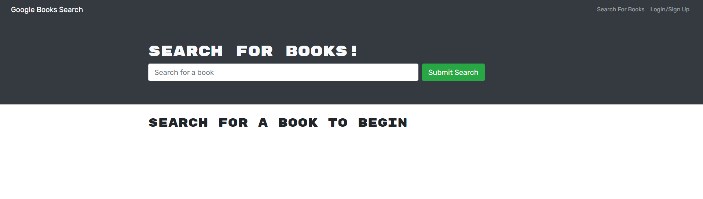

# Book Search 

  ## Description
  
  
This is a MERN application that uses GraphQL for a back-end using mongoose and a Front End by using React.

  
  ## Table of Contents
  
  - [Installation](#installation)
  - [Usage](#usage)
  - [License](#license)
  - [Contributing](#license)
  - [Tests](#license)
  - [Questions](#license)
  
  ## Installation
  
  
Currently in develop

  
  ## Usage
  
  
Currently in develop

  
  

  
  ## License
  
  
Copyright (c) 2022, Cesar Sanchez All rights reserved.
Licensed under the MIT license. 

  
  
[License](./MIT_license.txt)

  
  ## How to Contribute
  
  
Fix not working with GraphQL

  
  ## Tests
  
  
Currently in develop

  
  ## Questions
  
  If you have any question feel free to check my Github 
  
Username:csancheze
  
[Github](https://github.com/csancheze)

  or send me and email
  
<cesanchezesc@gmail.com>

